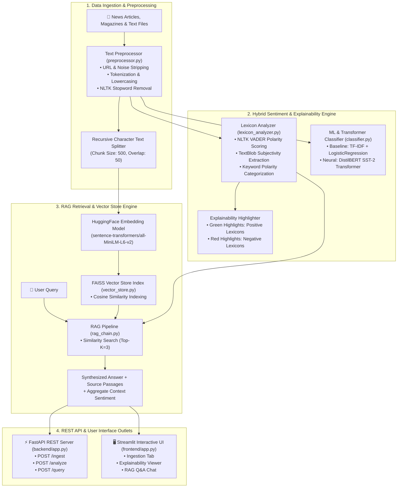

# Sentiment Analysis RAG Chatbot: Production Technical Manual & Documentation

---

## 1. Executive Overview

The **Sentiment Analysis RAG Chatbot** is an enterprise-grade AI solution engineered to process unstructured news articles, magazine publications, and editorial content. It combines **Retrieval-Augmented Generation (RAG)** with a **Hybrid Sentiment Analysis Engine** to allow users to perform semantic searches across document archives while receiving evidence-backed answers annotated with emotional tone (**Positive**, **Negative**, **Neutral**).

### Core Problem Solved
Traditional Large Language Models (LLMs) operate as black boxes, providing answers without transparent sentiment attribution or domain-specific emotional context. This system solves that problem by:
1. **Contextual Retrieval**: Indexing document passages into high-dimensional vector spaces using **FAISS** and **Sentence-Transformers**.
2. **Hybrid Sentiment Engine**: Blending fast lexicon scoring (**NLTK VADER**, **TextBlob**) with deep contextual models (**Scikit-learn**, **Transformers / DistilBERT**).
3. **Transparent Explainability**: Extracting and visually highlighting sentiment-bearing terms directly within source passages using color-coded HTML markings.
4. **Decoupled Service Architecture**: Exposing asynchronous REST microservices via **FastAPI** paired with an interactive **Streamlit** dashboard.

---

## 2. System Architecture & End-to-End Data Flow



---

## 3. Directory Structure & Module Breakdown

```text
C:\Madhu\Sentiment Analysis_New\
├── PROJECT_DESIGN.md           # High-level architecture blueprint & resume guide
├── PROJECT_DOCUMENTATION.md    # Comprehensive technical manual & operating guide
├── README.md                   # Quickstart instructions & execution guide
├── requirements.txt            # Complete Python dependency manifest
├── data_ingestion/             # Data preprocessing & text cleaning module
│   ├── __init__.py
│   └── preprocessor.py         # Regex cleaning, tokenization, stopword removal
├── sentiment/                  # Sentiment analysis & explainability module
│   ├── __init__.py
│   ├── lexicon_analyzer.py     # NLTK VADER, TextBlob, HTML lexicon highlighter
│   └── classifier.py           # TF-IDF + LogisticRegression / DistilBERT pipeline
├── rag/                        # RAG engine & vector store module
│   ├── __init__.py
│   ├── vector_store.py         # FAISS indexing & Hugging Face embedding manager
│   └── rag_chain.py            # LangChain similarity retrieval & Q&A pipeline
├── backend/                    # REST API microservice
│   ├── __init__.py
│   └── app.py                  # FastAPI application with /ingest, /analyze, /query
└── frontend/                   # Interactive Web Dashboard
    ├── __init__.py
    └── app.py                  # Streamlit dual-tab dashboard & visualizer
```

---

## 4. Complete Tools, Libraries & Frameworks Reference

The table below details all software tools, libraries, and frameworks utilized across the system, categorized by functional domain along with the technical rationale for their selection.

| Domain | Tool / Library | Version | Technical Rationale & Usage Description |
| :--- | :--- | :--- | :--- |
| **Core Language** | **Python** | `3.10+` | Primary programming language providing robust data science and NLP ecosystem. |
| **NLP & Preprocessing** | **NLTK** | `3.8.1+` | Provides VADER (`SentimentIntensityAnalyzer`), tokenization (`word_tokenize`), and stopword lists. |
| **NLP & Lexicons** | **TextBlob** | `0.17.1+` | Calculates word-level polarity ($\in [-1.0, 1.0]$) and document subjectivity ($\in [0.0, 1.0]$). |
| **NLP & Parsing** | **spaCy** | `3.7.2+` | Industrial-strength NLP library for entity extraction and POS-guided lemmatization. |
| **Machine Learning** | **Scikit-learn** | `1.3.2+` | Provides TF-IDF vectorization (`TfidfVectorizer`) and fast baseline Logistic Regression classification. |
| **Deep Learning** | **PyTorch** | `2.1.0+` | Underlying tensor and deep learning framework powering Hugging Face transformers. |
| **Transformer Models** | **Hugging Face Transformers** | `4.35.2+` | Provides fine-tuned neural models (`distilbert-base-uncased-finetuned-sst-2-english`). |
| **Dense Embeddings** | **Sentence-Transformers** | `2.2.2+` | Generates 384-dimensional dense vectors using `all-MiniLM-L6-v2`. |
| **Vector DB** | **FAISS (`faiss-cpu`)** | `1.7.4+` | Meta's library for high-speed similarity search and vector clustering. |
| **RAG Orchestration** | **LangChain Core & Community** | `0.1.0+` | Framework for connecting vector retrievers, document splitters, and LLM chains. |
| **Text Splitter** | **LangChain Text Splitters** | `1.1.2+` | Chunking engine (`RecursiveCharacterTextSplitter`) maintaining context boundaries. |
| **Backend Framework** | **FastAPI** | `0.104.1+` | Asynchronous, high-performance Web framework with automatic OpenAPI/Swagger generation. |
| **ASGI Web Server** | **Uvicorn** | `0.24.0+` | Lightning-fast ASGI server implementation for running FastAPI applications. |
| **Data Validation** | **Pydantic** | `2.5.2+` | Enforces strict schema validation for REST API request and response bodies. |
| **Frontend Framework** | **Streamlit** | `1.29.0+` | Turn Python scripts into interactive web dashboards with custom CSS and HTML rendering. |

---

## 5. Detailed Component Specifications & Code Walkthrough

### 5.1 Data Ingestion & Preprocessing (`data_ingestion/preprocessor.py`)
- **Functionality**: Strips URLs, HTML markup, and non-alphanumeric noise using compiled regular expressions. Tokenizes raw text using NLTK `word_tokenize` and removes English stopwords.
- **Key Method**: `preprocess_document(text: str) -> dict`

```python
class TextPreprocessor:
    def clean_text(self, text: str) -> str:
        text = re.sub(r'http\S+|www\S+|https\S+', '', text, flags=re.MULTILINE)
        text = re.sub(r'[^\w\s\.\,\!\?]', '', text)
        return re.sub(r'\s+', ' ', text).strip()
```

### 5.2 Lexicon Scoring & Explainability (`sentiment/lexicon_analyzer.py`)
- **Functionality**: Evaluates sentiment using NLTK VADER's compound polarity score ($\text{compound} \ge 0.05 \rightarrow \text{Positive}$; $\text{compound} \le -0.05 \rightarrow \text{Negative}$). Constructs HTML-formatted strings with color-coded `<mark>` tags around positive ($\text{green}$) and negative ($\text{red}$) lexicons.
- **Key Methods**: `analyze(text: str)` and `generate_html_highlights(text: str)`

```python
def generate_html_highlights(self, text: str) -> str:
    words = text.split()
    highlighted = []
    for word in words:
        clean_word = word.strip(".,!?\"'()[]")
        pol = TextBlob(clean_word).sentiment.polarity if clean_word else 0
        if pol > 0.2:
            highlighted.append(f'<mark style="background-color: #d4edda; color: #155724;">{word}</mark>')
        elif pol < -0.2:
            highlighted.append(f'<mark style="background-color: #f8d7da; color: #721c24;">{word}</mark>')
        else:
            highlighted.append(word)
    return " ".join(highlighted)
```

### 5.3 Sentiment Classifier (`sentiment/classifier.py`)
- **Functionality**: Supports dual classification modes: a lightweight TF-IDF + LogisticRegression model for fast CPU execution, and a DistilBERT transformer pipeline for deep semantic sentiment classification.

### 5.4 Vector Store Manager (`rag/vector_store.py`)
- **Functionality**: Converts text passages into 384-dimensional dense vectors using `sentence-transformers/all-MiniLM-L6-v2`. Indexes chunks into an in-memory **FAISS** vector database for sub-millisecond similarity retrieval.

### 5.5 RAG Sentiment Pipeline (`rag/rag_chain.py`)
- **Functionality**: Accepts user queries, performs top-$K=3$ cosine similarity search over FAISS indices, runs lexicon sentiment analysis on each retrieved passage, and calculates the overall aggregate context sentiment.

### 5.6 FastAPI Backend Server (`backend/app.py`)
Exposes three core REST endpoints:
1. `POST /ingest` – Accepts JSON array of article texts, cleans them, and indexes into FAISS.
2. `POST /analyze` – Accepts single article string, returns lexicon scores, ML confidence, and explainability HTML.
3. `POST /query` – Accepts user query string, executes RAG retrieval, and returns source passages with sentiment breakdown.

### 5.7 Streamlit Frontend Dashboard (`frontend/app.py`)
Provides an interactive 3-tab layout:
- **Tab 1 (Article Ingestion)**: Raw article text area and indexing trigger.
- **Tab 2 (Sentiment & Explainability)**: Polarity gauge metrics, confidence scores, and visual word highlight container.
- **Tab 3 (RAG Chatbot)**: Q&A query bar with source passage expandable cards and compound sentiment tags.

---

## 6. REST API Reference & Data Contracts

### 6.1 Ingestion Endpoint (`POST /ingest`)
- **Request Body**:
  ```json
  {
    "articles": [
      "The economy expanded by 4.2% in Q3, driven by strong consumer spending and record exports."
    ]
  }
  ```
- **Response Body**:
  ```json
  {
    "status": "success",
    "ingested_count": 1,
    "message": "Successfully ingested 1 articles into vector store."
  }
  ```

### 6.2 Sentiment Analysis Endpoint (`POST /analyze`)
- **Request Body**:
  ```json
  {
    "text": "Company revenues surged due to unprecedented profits, despite minor supply chain disruptions."
  }
  ```
- **Response Body**:
  ```json
  {
    "status": "success",
    "lexicon_analysis": {
      "label": "Positive",
      "compound": 0.6124,
      "polarity": 0.4333,
      "subjectivity": 0.6500,
      "positive_keywords": ["unprecedented", "profits", "surged"],
      "negative_keywords": ["disruptions"]
    },
    "ml_classification": {
      "label": "Positive",
      "confidence": 0.9421,
      "model_type": "ML (TF-IDF + LogisticRegression)"
    },
    "explainability_html": "Company revenues <mark style=\"background-color: #d4edda;\">surged</mark> due to..."
  }
  ```

---

## 7. Step-by-Step Operating & Execution Guide

### Step 1: Virtual Environment Setup
```bash
cd "C:\Sentiment Analysis_New"
python -m venv venv
# Activate on Windows:
venv\Scripts\activate
```

### Step 2: Install Package Dependencies
```bash
pip install -r requirements.txt
python -m spacy download en_core_web_sm
```

### Step 3: Run Backend API Server
```bash
python -m uvicorn backend.app:app --host 0.0.0.0 --port 8000
```
- Access Interactive Swagger API Docs at: `http://localhost:8000/docs`

### Step 4: Run Frontend Streamlit Dashboard
```bash
streamlit run frontend/app.py
```
- Access Dashboard at: `http://localhost:8501`

---

## 8. Deployment & Cloud Hosting Architecture

1. **Docker Containerization**:
   - Multi-stage build packaging Python runtime, PyTorch, FAISS, FastAPI, and Streamlit.
2. **AWS Deployment**:
   - **Backend API**: Hosted on **AWS App Runner** or **AWS ECS Fargate**.
   - **Storage**: Vector indices and raw document archives synced to **AWS S3** bucket.
   - **Frontend**: Deployed to **Streamlit Community Cloud** or **AWS Amplify**.
3. **OneDrive / Cloud Sync**:
   - Integration script syncs raw magazine PDFs and articles from Microsoft OneDrive via Graph API directly into the ingestion pipeline.

---

## 9. Resume & Portfolio Bullet Points

- **Architected & Implemented a Sentiment-Aware RAG Chatbot** leveraging **LangChain**, **FAISS**, and **Hugging Face Transformers** to analyze news articles with high contextual sentiment accuracy.
- **Engineered an Explainable NLP Engine** using **spaCy**, **NLTK VADER**, and **TextBlob** that extracts sentiment lexicons and dynamically highlights influential text spans for transparent AI outputs.
- **Built a Production Microservice Architecture** featuring an asynchronous **FastAPI** backend API and an interactive **Streamlit** dashboard for real-time document search and sentiment analytics.
